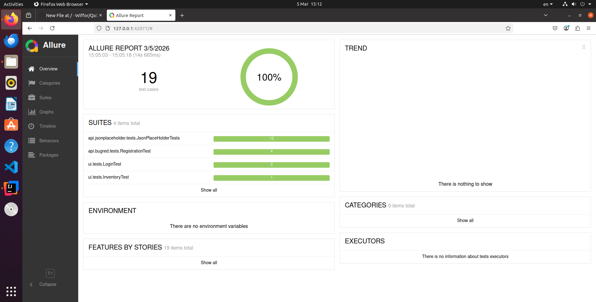
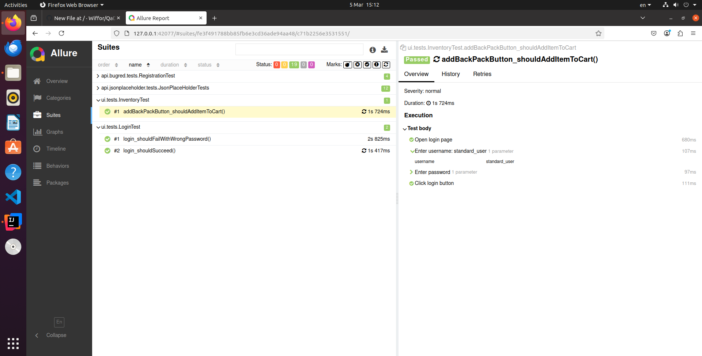

**AQA Java Automation Framework**
-
Проект для практики автоматизации тестирования API и UI на Java.

**Используемый стек:**
- Java 21
- Maven
- JUnit 5
- RestAssured
- Selenium WebDriver
- WebDriverManager
- AssertJ
- Awaitility
- Allure Report
- GitHub Actions

Цель проекта - продемонстрировать простой "скелет", который демонстрирует базовую архитектуру автотестов, работу с REST API, UI-тестирование и CI-интеграцию.

В проекте используется два типа тестов:
-
- **API тесты**
  - **JSONPlaceholder** - публичный сервис, имитирующий Crud операции, однако не применяющий их к БД.
    
     Реализованные проверки: получение списка пользователей, получение пользователя по id, negative сценарии, POST запросы, проверка структуры ответа
      
  - **Bugred Test API** - публичный сервис, исполняющий Crud операции с добавлением в БД, с намеренно оставленными багами для практики тестирования.
     
     Реализованные проверки: регистрация пользователя, обработка дублирования email, обработка дублирования name, сценарий create -> search, работа с Awaitility
     Подход - DTO-модели, API client,Request/Response specs, BaseTest, Factory

TestDataFactory для генерации тестовых данных

- **UI тесты**
   saucedemo (saucedemo.com)
   Сценарии: успешный логин, ошибка логина, добавление товара в корзину, проверка содержимого корзины.
   Подход: Page Object

Запуск Тестов
-
- Запустить все тесты:
  - mvn clean test
- Только API
  - mvn test -Dgroups=api
- Только UI
  - mvn test -Dgroups=ui
  
После выполнения тестов для просмотра отчета необходимо выполнить команду:
-
allure serve allure-results

Для демонстрации CI используется GitHub Actions при каждом push. 
- Автоматически выполняются:
  - сборка проекта, 
  - запуск тестов, 
  - сохранение Allure results

To do list:
-
- [x] Base API
- [x] Multiple API
- [x] DTO-model bugred
- [x] API client bugred
- [x] API client jsonplaceholder
- [x] Factory testdata bugred
- [x] Base UI
- [x] Page Object UI
- [x] Screenshot on UI test fail
- [ ] additional UI/API tests
- [ ] Component object pattern UI
- [ ] Testcontainers
- [ ] WireMock Mocking
